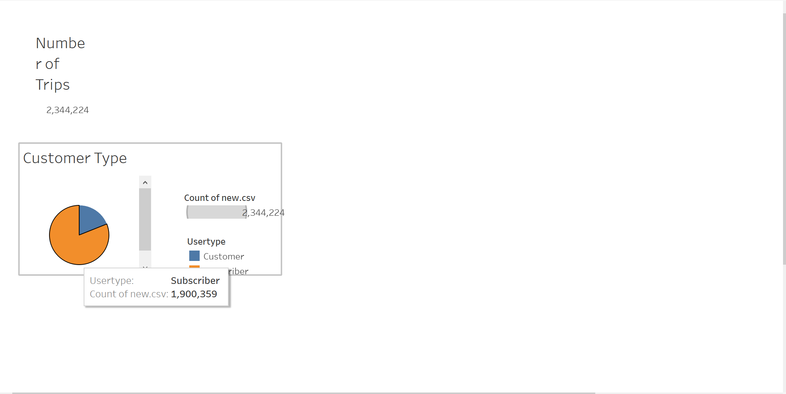
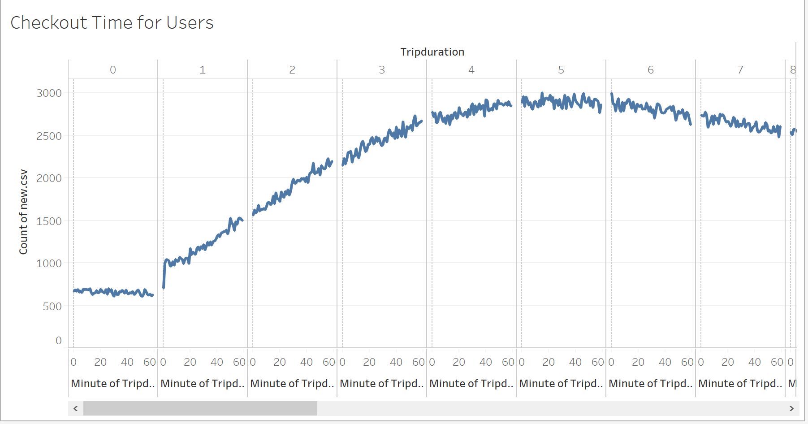
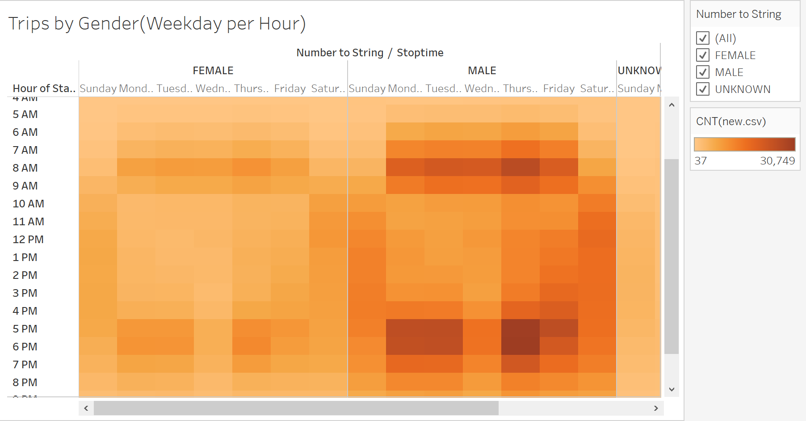
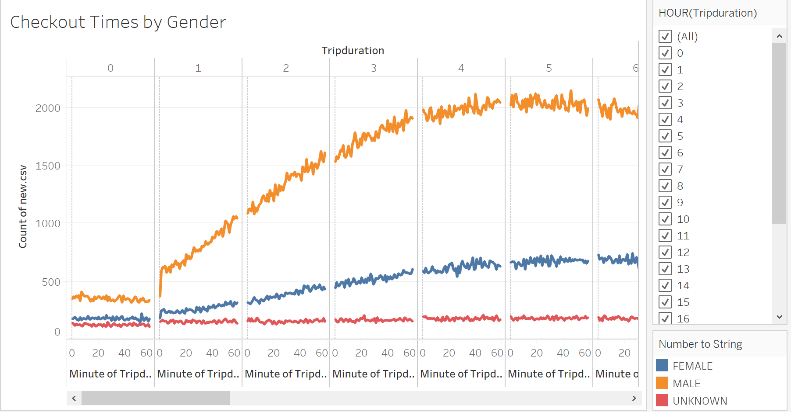
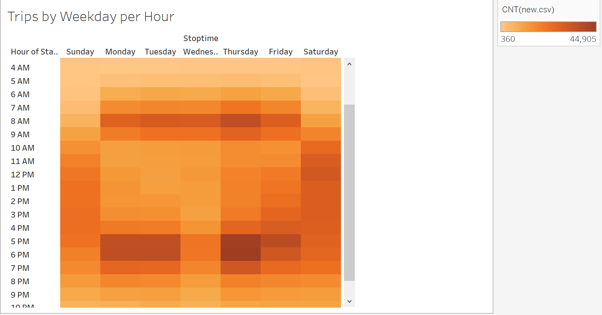
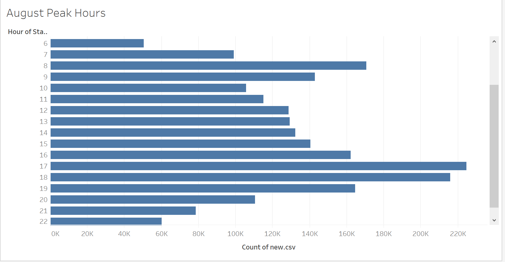
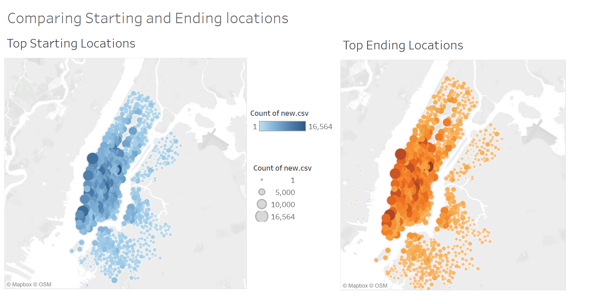

# NYC Bikeshare Analysis
## Overview of the Analysis ##
### Purpose 

The purpose of this analysis is to provide references for investors who wants to invest in Bikeshare program in Des Moines. Using Tableau, I'm able to visualize the data, and provide a better analysis for the investors. The data I'm using is from NYC Citi Bike data that was provided on the citi Bike website. In order to complete the analysis, I will have to convert the data, from a number value to datetime data (Using Pandas, Jupyter Notebook). After convert the data, I can start to analyze and compare, I'll be able to tell the difference between different genders, and also able to see what timeframes are the most riders going to be using the bikes, knowing these, it will help the bikeshare project in Des Moines tremendously. 

### Results

To view the results, I've attached the link to my Tableau Public dashboard [link to dashboard](https://public.tableau.com/profile/ling.zhang3030#!/)

The screenshot above is giving us the total number of riders in the month of August, and we can see that there are two types of customers, subscribers and customers. Customers are the ones that just occasionaly use the services, meanwhile subscribers are the ones who are going to be using the services quite a lot. We can see that out of the total number of 2,344,224 rides, 1,900,359 of them are subscribers. So this is pretty obvious for the investors that, subscribers are going to be the major part of their bikeshare program.  

The screen above provides information about the duration of bike rides. We can see that the majority of rides are between 4.5 and 6.5 hours in duration. We can learn two things: there will be less bikes avaiable during the peak hours, and also longer usage will also increase the wear and tear of the bikes. 

There are two screenshots above, which I want to put them together, because I can see a lot of relativeness between them. The first image shows us that there are more men riders than women, also more subscriber riders than customer riders. The second image shows us that male riders using bikes mainly around morning and evening rush hours.  

The image above shows us in a bigger picture on how different gender uses bikes in different hours. We can see that majority of the bikeshares are used by male riders. 

The image above just shows us that during weekdays how many trips there are and between what time. The pattern tells us that mostly takes place during rush hours in the morning and in the evening. 

The image above is another way of telling us the peak hours of each day, most of the rides starts from 7am and ends around 7 pm, and rush hours in the morning between 7am to 9am, and in the evening between 5pm to 7pm. 

The image above can tell us the comparison between top starting locations and ending locations, we can see, that most of the locations are located in Manhattan, where most of the populations are, especially around the big subway stations or train stations. 

## Summary
To summarize our findings, we can see that in the New York City, the demand for bikes are very high, and mostly during rush hours, there are more male riders than female and there are more subscribers than regular customers. 
To provide a little extra thoughts, are there going to be enough people in Des Moines who needs bikes like those people in New York? Because after all, it's New York, I think this analysis provides a really good reference for the investors, also something to think about, considering the differences between different cities, certain plans needs to be made and adjusted. 
